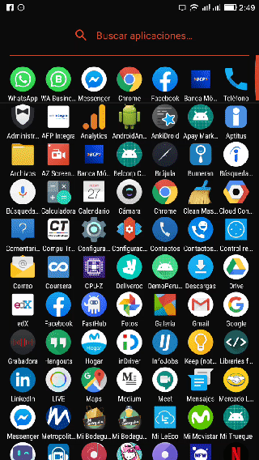

 

# Demo Peru Apps
Mini proyecto para evaluación técnica para la empresa Peru Apps.

## Tabla de contenidos

- [Estructura del proyecto](#estructura-del-proyecto)
- [Capas de aplicacion](#capas-de-aplicacion)

---
## Capas de aplicación
 Para el proyecto utilizamos la arquitectura de componentes, recomendada por Google. Adicionalmente usamos objetos LiveData,
 que son obejtos reactivos, tienen el beneficio de restepar el ciclo de vida de nuestros componentes, 
 solo invoca a su devolución de llamada solo cuando la vista este activa.
- **Model**
  --> En esta capa se encuentra la lógica de negocio y las conexiones a los datos, en nuestro caso usamos flows para comunicarnos con Firestore., 
  a esta capa pertenecen los paquetes `repository` y `source`.
- **View**
  --> En esta capa se encuentran la interfaz de usurario, esta capa se encuentra observando al View Model para actualizarse cuando los datos cambien.
- **ViewModel**
  --> Esta capa se encarga de preparar y administrar los datos a la interfaz de usuario, y es observado por esta. Contiene objetos LiveData para captar cambios en el repositorio y transmite los datos a la capa View. También sobrevive a los cambios de configuracion de la activity y/o fragment que la observa porque tiene un ciclo de vida independiente.
  
  
  

